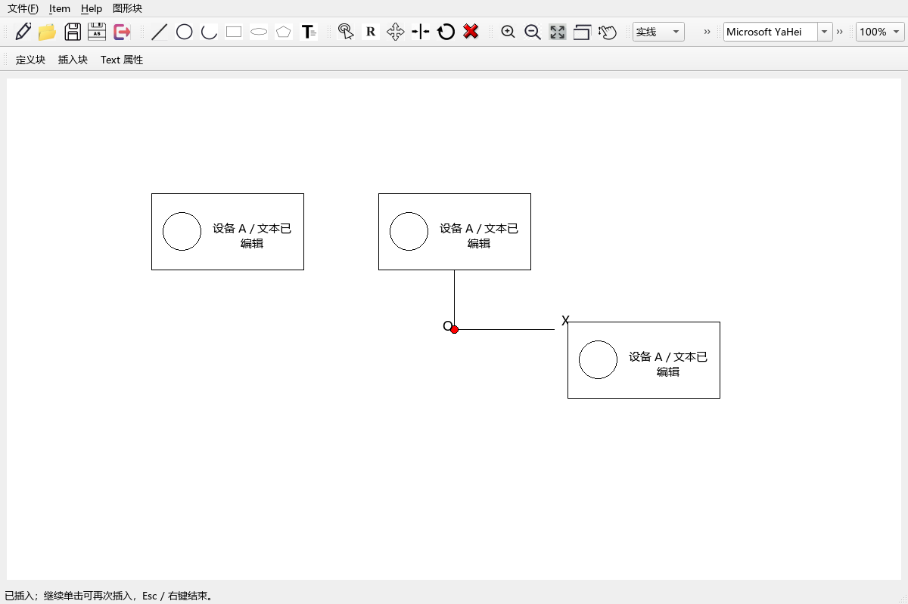

# QCAD_more

基于课程 QCAD 的 C++/Qt 图形学作业，实现“图形块操作：定义与插入”。已完成复合图形选择、块定义、Text 属性编辑、鼠标定位插入、文档保存与重新打开。



## 运行

本机已配置好独立环境并完成 Release 编译，双击仓库根目录的 **Start-QCAD.cmd** 即可启动。也可以在项目目录运行：

```powershell
powershell -NoProfile -ExecutionPolicy Bypass -File scripts/run.ps1
```

程序位于 `build/cmake/Release/QCAD_more.exe`，启动脚本为该进程设置 Qt DLL 和插件路径；不要把 exe 单独复制出去运行。

## 作业操作步骤

1. 使用原绘图工具栏绘制直线、矩形、圆、椭圆、圆弧、多边形或 Text。普通图形依次单击指定点；圆弧为圆心、起点、终点；多边形双击结束；Text 指定两个文本框角点后输入内容。
2. 按 Esc 切换到选择状态，拖框完全包围多个图元；Shift 单击/拖框可追加，Ctrl+A 可全选。
3. 点击 **定义块**，输入唯一块名，再在画布上单击基点。原图形保留，块定义保存独立快照。
4. 选中单个 Text，点击 **Text 属性** 或 Ctrl+E，编辑内容、字体、字号、字形、颜色及文本框位置和尺寸。确认后应用，取消不修改。
5. 点击 **插入块**，选择定义，移动鼠标预览，单击插入。可连续插入多个实例，Esc/右键结束。
6. 在 **文件 → 保存/另存文件** 中保存为 `.qbl`；重新打开后，图形、文本属性、块定义和实例位置均会恢复，仍能继续插入已有块。

可用 **文件 → 打开文件** 打开 [示例文档](examples/block-demo.qbl)，其中包含一个复合块定义、原始图元和两个插入实例。完整说明见 [使用指南](docs/usage.md)。

## 开发环境与构建

使用 Visual Studio 2022 C++ 工具链、CMake、Qt 5.15.2 和 C++14。Qt SDK 与辅助 Python 环境都在项目 `build/` 下，**不依赖 lerobot，不向其安装包**。

新机器需先安装 Visual Studio C++/CMake 和 Conda，再执行：

```powershell
# Conda 已在 PATH 时可省略 -CondaExe；本机路径如下。
powershell -NoProfile -ExecutionPolicy Bypass -File scripts/setup-qt.ps1 -CondaExe D:\conda\Scripts\conda.exe
powershell -NoProfile -ExecutionPolicy Bypass -File scripts/build.ps1 -Check
```

普通开发使用 `scripts/build.ps1`；只有需要验证业务改动时加 `-Check`。`setup-qt.ps1` 在 `build/qt-dev` 创建独立 Python 3.11 环境，以 aqtinstall 3.3.0 下载 Qt 5.15.2 基础开发包。辅助脚本不参与产品运行。

完成作业后，先关闭 QCAD，把需要保留的 `.qbl` 文件移到 `build/` 之外，然后删除整个 `build/` 即可移除项目 Qt SDK、独立工具环境和编译产物。若希望同步移除 Conda 环境登记，可先运行：

```powershell
D:\conda\Scripts\conda.exe env remove --prefix .\build\qt-dev --yes
```

源码、开发文档和 `examples/` 不受影响；系统已有 Visual Studio/CMake 和 Conda 本身不在本项目清理范围。

## 结构与维护

```text
src/
├── qcad/          # 引入并修复的课程图元、视图与窗口
├── selection/     # 点选、拖框、Shift 追加选择
├── blocks/        # 块定义、实体与插入
├── text/          # 文本属性服务与对话框
├── storage/       # 图元编解码、文档保存/读取
├── integration/   # 菜单协调及绘图/选点命令
└── common/        # 操作结果
scripts/            # 独立环境安装、构建、运行
tests/              # 核心业务与窗口流程验证
examples/           # 可直接打开的演示文档
docs/               # 使用、设计、来源和每次开发记录
```

开发前阅读 [AGENTS.md](AGENTS.md)。每次修改填写开发记录；模块契约及格式见 [设计说明](docs/architecture/block-operations.md)，来源见 [课程源码记录](docs/provenance/README.md)。

## 验证与范围

Release 编译及 CTest 已通过。验证覆盖七类图元成块、原图形保持不变、多次插入和整体移动、中文/字体/颜色保存重开、损坏文件与保存失败保护，以及实际 Qt 窗口的绘制、选择、编辑和插入操作。截图来自该窗口流程。

第一版提供平移插入，不包含嵌套块、块实例内部文字覆盖、DXF/DWG 或旧课程 `.cad` 格式兼容；原课程中的旋转/镜像等未完成工具不属于本次交付。Text 属性编辑作用于独立文本，成块时会保存当时的文本属性。
